# AI Industry Impact Analysis via NLP — UChicago ADSP 32018 Final Project

<!-- BADGES_BEGIN -->
<p align="center">
  
  
  
  
  
</p>

<p align="center">
  
  
  
  
  
  
  
  
  
  
  
</p>
<!-- BADGES_END -->

**Course:** ADSP 32018 — Next-Gen NLP: Transformers, LLMs and Agentic AI in Practice (Winter 2025, University of Chicago)  
**Author:** Chiyang Chen  
**Dataset:** ~200K news articles on AI, ML, and data science

---

## Project Overview

An end-to-end NLP pipeline that mines ~200K tech news articles to answer a core question: **which industries will be most impacted by AI, how (positively or negatively), and through what mechanisms?**

Motivated by the 2023 Goldman Sachs report estimating ~25% of US/Europe tasks are automatable by AI, and validated by Facebook Research's Moravec's Paradox findings — that AI disrupts cognitive/office work far more than physical/sensorimotor tasks.

**Research Questions**

1. Which industries and companies are most likely to be impacted by AI over the next several years?
2. How will they be impacted — positively, negatively, or ambiguously — and through what means (automation, augmentation, cost reduction, workflow redesign)?
3. What factors make AI adoption successful or unsuccessful?

---

## Pipeline Overview

```mermaid
flowchart TD
    subgraph Source["Source Corpus and Profiling"]
        Raw@{ shape: cyl, label: "Raw news corpus<br/>news_final_project.parquet<br/>~200K articles" }
        EDA@{ shape: doc, label: "01 Data ingestion and EDA<br/>schema, missingness, duplicates<br/>time and text-scale diagnostics" }
    end

    subgraph Filtering["AI-Relevance Filtering"]
        Docs@{ shape: doc, label: "02A Document table<br/>docs.parquet<br/>domain and quarter buckets" }
        Blocks@{ shape: lin-doc, label: "02A Paragraph block shards<br/>blocks/part_*.parquet" }
        BlockSample@{ shape: bow-rect, label: "02A Stratified block sample<br/>block_sample.parquet" }
        BlockLabels@{ shape: tag-doc, label: "02A DeepSeek block labels<br/>block_labels.parquet" }
        BlockModel@{ shape: fr-rect, label: "02B Block encoder classifier<br/>validation threshold selection" }
        AIBlocks@{ shape: cyl, label: "02B AI-positive block corpus<br/>ai_blocks.parquet" }
        Sentences@{ shape: lin-doc, label: "02C Sentence shards from AI blocks<br/>sentences/part_*.parquet" }
        SentenceSample@{ shape: bow-rect, label: "02C Stratified sentence sample<br/>sentences_sample.parquet" }
        SentenceLabels@{ shape: tag-doc, label: "02C DeepSeek sentence labels<br/>sentence_labels.parquet" }
        SentenceModel@{ shape: fr-rect, label: "02D Sentence content classifier<br/>full-corpus prediction" }
        CleanCorpus@{ shape: cyl, label: "02D Rebuilt clean AI corpus<br/>clean_ai_blocks.parquet<br/>clean_ai_docs.parquet" }
    end

    subgraph Analysis["Industry, Entity, and Sentiment Analysis"]
        Topics@{ shape: fr-rect, label: "03 BERTopic modeling<br/>topic_summary.csv<br/>topic_time_panel.parquet" }
        Entities@{ shape: tag-rect, label: "04 GLiNER entity extraction<br/>deterministic canonicalization<br/>LLM entity merge" }
        EntityContexts@{ shape: docs, label: "04 Entity analysis tables<br/>entity_analysis_summary.parquet<br/>entity_contexts_final.parquet" }
        SentimentData@{ shape: tag-doc, label: "05A Entity-conditioned label pool<br/>DeepSeek sentiment labels<br/>sentiment_training_data.parquet" }
        SentimentModel@{ shape: fr-rect, label: "05B Transformer sentiment classifier<br/>best_model/<br/>validation metrics" }
        SentimentAgg@{ shape: st-rect, label: "05C Full sentiment inference<br/>entity, type, time, domain<br/>and optional topic aggregation" }
    end

    subgraph Outputs["Presentation Outputs"]
        Assets@{ shape: docs, label: "06 Presentation assets<br/>executive summary panels<br/>industry rankings<br/>entity impact maps" }
    end

    Raw --> EDA --> Docs --> Blocks --> BlockSample --> BlockLabels --> BlockModel --> AIBlocks
    AIBlocks --> Sentences --> SentenceSample --> SentenceLabels --> SentenceModel --> CleanCorpus
    CleanCorpus --> Topics
    CleanCorpus --> Entities --> EntityContexts --> SentimentData --> SentimentModel --> SentimentAgg
    Topics --> SentimentAgg
    Topics --> Assets
    EntityContexts --> Assets
    SentimentAgg --> Assets

    class Raw,Docs,Blocks,AIBlocks,Sentences,CleanCorpus,EntityContexts info
    class EDA,BlockSample,SentenceSample primary
    class BlockLabels,SentenceLabels,Entities,SentimentData accent
    class BlockModel,SentenceModel,Topics,SentimentModel secondary
    class SentimentAgg,Assets success
    classDef primary fill:#00A8B8,stroke:#00A8B8,color:#203040
    classDef secondary fill:#688858,stroke:#688858,color:#203040
    classDef accent fill:#F86800,stroke:#F86800,color:#203040
    classDef success fill:#00B800,stroke:#00B800,color:#203040
    classDef info fill:#7080A0,stroke:#7080A0,color:#203040
```



---

## Notebooks

| Notebook | Stage | Description |
|---|---|---|
| `01_data_ingestion_eda.ipynb` | EDA | Load parquet corpus; profile shape, fields, missing values, time distribution, and duplicates |
| `02A_block_sample_and_label.ipynb` | Filtering | Sample article text blocks; manually label for AI-relevance |
| `02B_block_train_predict.ipynb` | Filtering | Train block-level classifier; threshold selection; predict over full corpus to isolate AI-relevant blocks |
| `02C_sentence_sample_and_label.ipynb` | Filtering | Sample and label at sentence granularity for finer-grained filtering |
| `02D_sentence_train_predict_and_rebuild.ipynb` | Filtering | Train sentence classifier; predict; reconstruct cleaned AI-relevant document corpus |
| `03_topic_modeling.ipynb` | Analysis | BERTopic on filtered corpus; identify industry themes and AI application clusters |
| `04_entity_extraction.ipynb` | Analysis | GLiNER NER to extract organizations and technologies; LLM-based canonical name cleaning |
| `05A_sentiment_dataset_creation.ipynb` | Sentiment | Construct labeled sentiment training dataset from news content |
| `05B_sentiment_model_training.ipynb` | Sentiment | Train custom sentiment classifier (fine-tuned; no pre-labeled HuggingFace models used) |
| `05C_sentiment_inference_and_aggregation.ipynb` | Sentiment | Run inference at scale; aggregate by topic, entity, and time |
| `06_presentation_assets.ipynb` | Output | Final visualizations: industry impact rankings, sentiment trends over time, entity-level breakdowns |

---

## Tech Stack

| Component | Tools |
|---|---|
| Data handling | `pandas`, `pyarrow` |
| Article filtering | Custom block & sentence classifiers (`scikit-learn`) |
| Topic modeling | `BERTopic`, `sentence-transformers`, `UMAP`, `HDBSCAN` |
| Named entity recognition | `GLiNER`, LLM API (canonical cleaning) |
| Sentiment analysis | Custom fine-tuned model (trained from labeled data) |
| Visualization | `matplotlib`, `plotly` |

---

## Key Findings

See the presentation slides and `06_presentation_assets.ipynb` for the full analysis. High-level results cover:
- Industries with highest AI exposure (legal, finance, healthcare, office automation)
- Company-level sentiment breakdown (who is positioned positively vs. at risk)
- Temporal trends in AI adoption sentiment (2020–2023)
- Technologies driving impact (LLMs, automation tools, robotics)

---

## How to Run

```bash
jupyter notebook 01_data_ingestion_eda.ipynb
```

Due to `ipywidgets` compatibility, some interactive outputs may not render in GitHub's notebook viewer. Clone the repo and run locally, or open in [nbviewer](https://nbviewer.org/).
