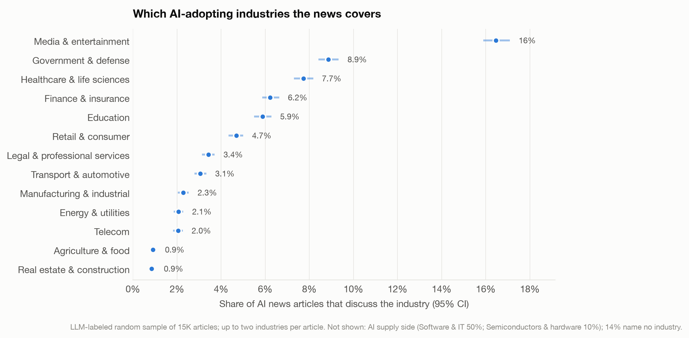
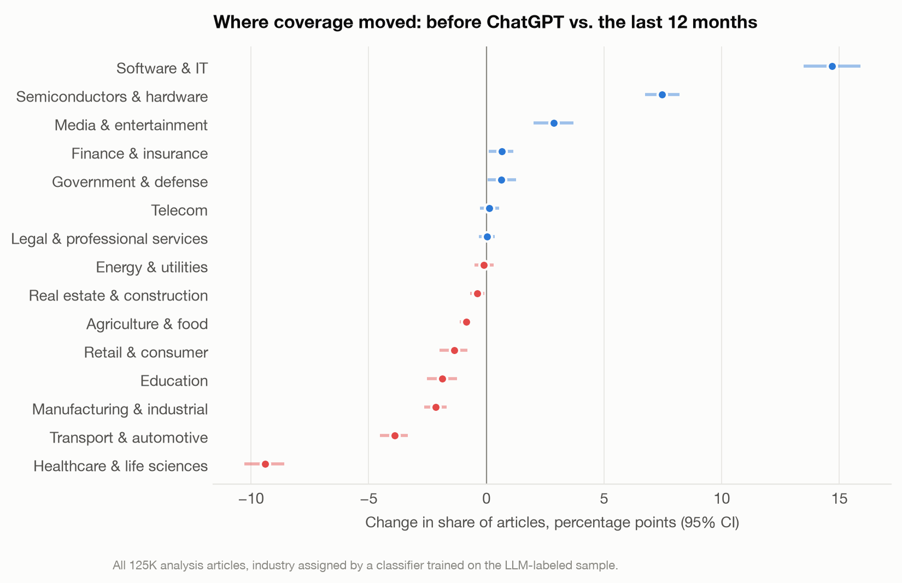
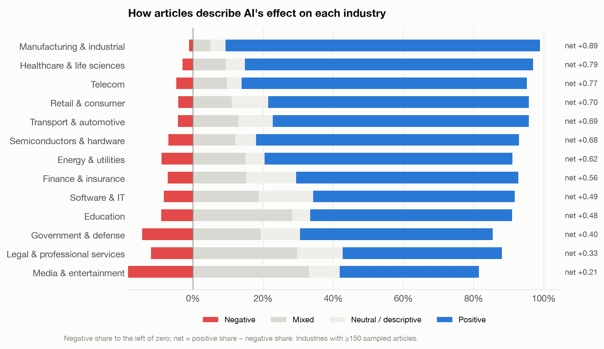
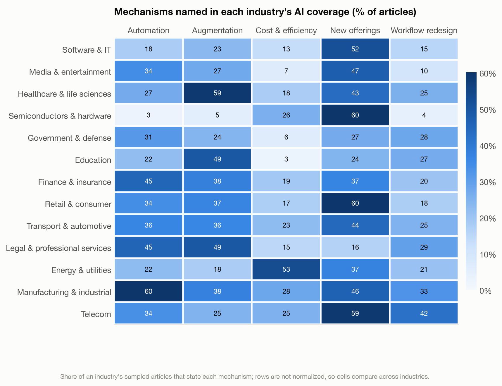
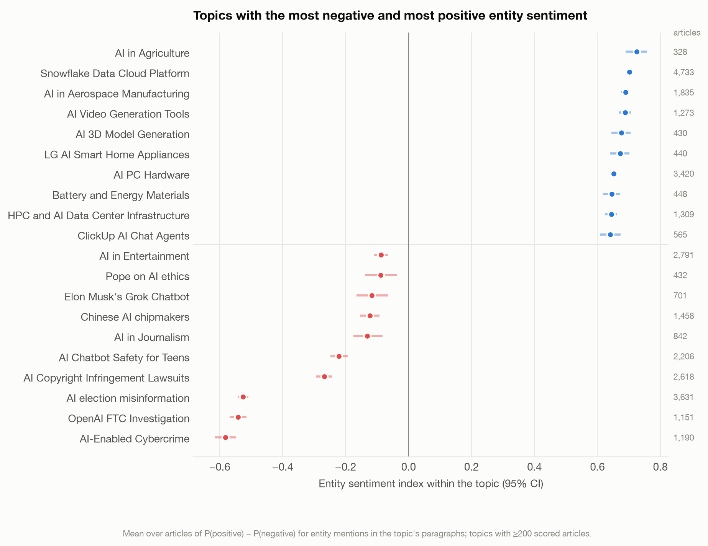
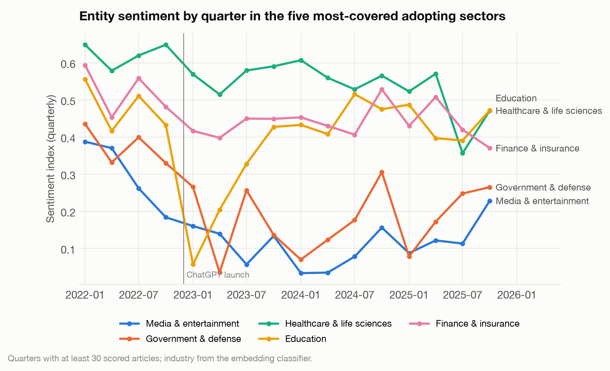
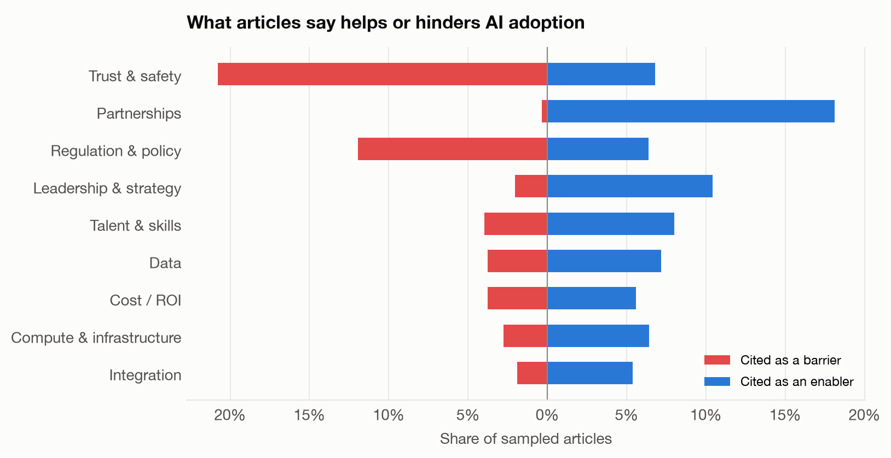
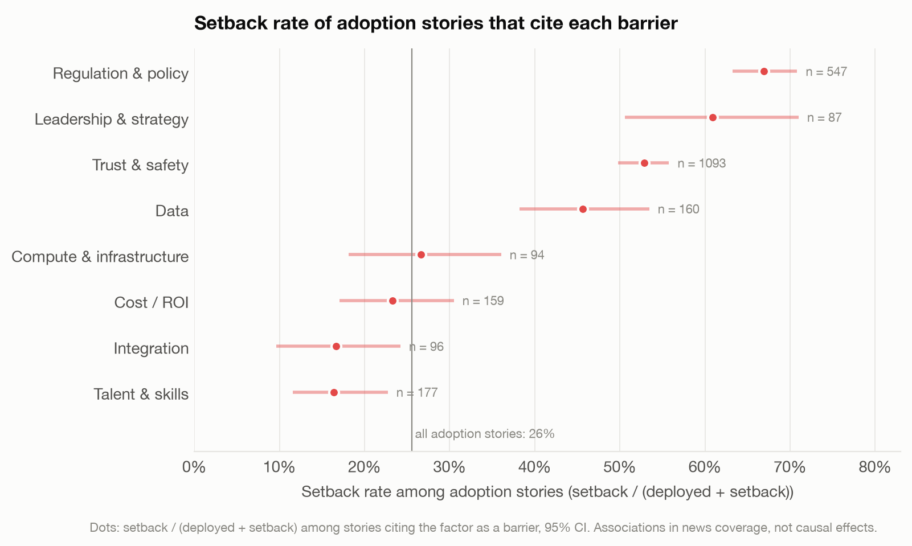
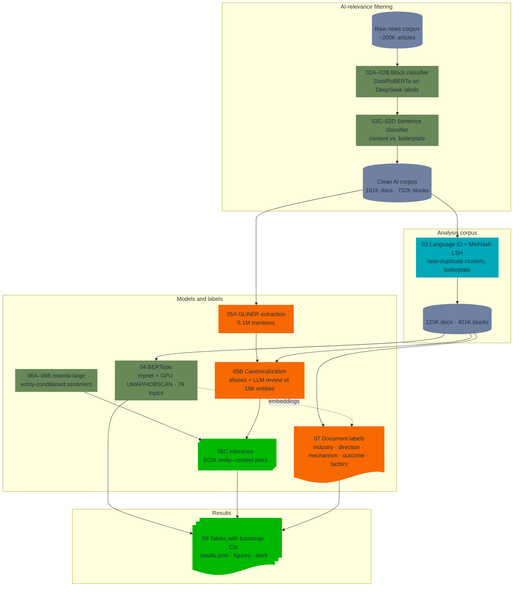

# AI Industry Impact Analysis via NLP

> Which industries does AI news say AI is changing, in which direction, and what separates adoption that works from adoption that stalls? Topic modeling, entity extraction, entity-level sentiment and structured LLM labeling over 125K de-duplicated AI news articles (2022–2026).

<!-- BADGES_BEGIN -->
<p align="center">
  
  
  
  
  
  
  
  
  
  
</p>

<p align="center">
  
  
  
  
</p>
<!-- BADGES_END -->

---

Goldman Sachs (2023) estimates that about a quarter of work tasks in the US and Europe could be automated by AI, with office, legal, architecture and social-science work most exposed and construction, installation and maintenance largely unaffected; Moravec's paradox gives the same ordering, since abstract reasoning is easier to automate than sensorimotor skill. This project asks what AI news coverage shows about which industries and companies are affected, how, and what separates adoption that works from adoption that stalls.

## Key findings

**1. Half of AI news is about the AI industry itself.** Software & IT appears in 50% of articles and semiconductors & hardware in 10%. Among sectors *adopting* AI, media & entertainment leads (16.5%), followed by government & defense (8.9%), healthcare (7.7%), finance (6.2%) and education (5.9%). After ChatGPT, coverage shifted toward the supply side (software +15 pp, chips +7.5 pp) and away from healthcare (14.6% → 5.2% of articles), transport and manufacturing.

<p align="center"> </p>

**2. Framing is positive almost everywhere; media and legal services are the most contested sectors, followed by government.** Net framing (positive − negative share) runs from +0.89 for manufacturing and +0.79 for healthcare down to +0.33 for legal services and +0.21 for media, where 18.5% of articles are negative. A separately trained entity-level sentiment classifier, scoring mentions rather than articles, ranks the 13 industries the same way (Spearman ρ = 0.96). Automation is the dominant mechanism in manufacturing (60% of articles) and finance (45%); augmentation in healthcare (59%) and education (49%); cost and efficiency in energy (53%).

<p align="center"> </p>

Topic-level sentiment is most negative for AI-enabled cybercrime (−0.58), the FTC investigation of OpenAI (−0.54), election misinformation (−0.53) and copyright lawsuits (−0.27); the most positive topics are applied ones such as agriculture, data-cloud platforms and aerospace manufacturing (≈ +0.7).

<p align="center"> </p>

Among the 20 most-covered companies, infrastructure and enterprise vendors draw the warmest coverage (AWS 0.45, Samsung 0.39, Salesforce 0.37, Nvidia 0.35), the most-covered AI firms sit lower (Google 0.13, OpenAI 0.11), and X, DeepSeek and Tesla fall below zero. Entity sentiment dropped from 0.41 in 2022 to 0.27 in 2023 and has stayed near 0.3 since. By sector, education fell from 0.43 to 0.06 in the quarter after ChatGPT's release and then recovered to about 0.44, while media slid from 0.39 in early 2022 to 0.03 in 2024.

**3. Setbacks coincide with regulation, leadership and trust barriers, not with skills or integration.** Trust & safety (21% of articles) and regulation (12%) are the most-cited barriers; partnerships the most-cited enabler (18%). Among adoption stories, 26% report a setback overall, but 67% of those citing a regulatory barrier do, 61% leadership & strategy, 53% trust & safety and 46% data. Stories citing talent or integration barriers report setbacks less often than average (16–17%): those barriers are described alongside deployments that go ahead.

<p align="center"> </p>

Consistent with the exposure estimates above, legal coverage is automation-heavy (45% of legal articles cite automation), while construction and agriculture are the least-covered sectors (under 1% of articles each).

These are statements about news coverage (what is reported and how), not measurements of realized economic effects. Slides (23): [`reports/AI_Impact_on_Industries.pptx`](reports/AI_Impact_on_Industries.pptx).

---

## Data

~200K scraped news articles about AI (URL, date, title, full text), 2022-01-01 to 2026-02-10. The analysis corpus after filtering and de-duplication:

| Stage | Documents | Notes |
|---|---:|---|
| Raw articles | 199,989 | |
| AI-relevant after block + sentence filtering (02A–02D) | 181,008 | 731,989 clean AI paragraphs |
| English after language ID (03) | 180,229 | the source `language` field marks every page `en` |
| De-duplicated analysis set (03) | 124,741 | 49,941 syndicated copies collapsed, documents under 300 characters dropped; 400,662 non-boilerplate paragraphs |

---

## Pipeline


```mermaid
flowchart TD
    subgraph Filter["AI-relevance filtering"]
        Raw@{ shape: cyl, label: "Raw news corpus<br/>~200K articles" }
        Block@{ shape: fr-rect, label: "02A–02B Block classifier<br/>DistilRoBERTa on DeepSeek labels" }
        Sent@{ shape: fr-rect, label: "02C–02D Sentence classifier<br/>content vs. boilerplate" }
        Clean@{ shape: cyl, label: "Clean AI corpus<br/>181K docs · 732K blocks" }
    end

    subgraph Corpus["Analysis corpus"]
        Dedup@{ shape: fr-rect, label: "03 Language ID + MinHash LSH<br/>near-duplicate clusters, boilerplate" }
        Ana@{ shape: cyl, label: "125K docs · 401K blocks" }
    end

    subgraph Models["Models and labels"]
        Topics@{ shape: fr-rect, label: "04 BERTopic<br/>mpnet + GPU UMAP/HDBSCAN · 79 topics" }
        NER@{ shape: tag-rect, label: "05A GLiNER extraction<br/>5.1M mentions" }
        Ents@{ shape: tag-rect, label: "05B Canonicalization<br/>aliases + LLM review of 15K entities" }
        SentModel@{ shape: fr-rect, label: "06A–06B roberta-large<br/>entity-conditioned sentiment" }
        Infer@{ shape: st-rect, label: "06C Inference<br/>502K entity–context pairs" }
        Docs@{ shape: tag-doc, label: "07 Document labels<br/>industry · direction · mechanism · outcome · factors" }
    end

    subgraph Out["Results"]
        Res@{ shape: docs, label: "08 Tables with bootstrap CIs<br/>results.json · figures · deck" }
    end

    Raw --> Block --> Sent --> Clean --> Dedup --> Ana
    Ana --> Topics
    Clean --> NER --> Ents
    Ana --> Ents
    SentModel --> Infer
    Ents --> Infer
    Ana --> Docs
    Topics -. embeddings .-> Docs
    Topics --> Res
    Infer --> Res
    Docs --> Res

    class Raw,Clean,Ana info
    class Dedup primary
    class NER,Ents,Docs accent
    class Block,Sent,Topics,SentModel secondary
    class Infer,Res success
    classDef primary fill:#00A8B8,stroke:#00A8B8,color:#203040
    classDef secondary fill:#688858,stroke:#688858,color:#203040
    classDef accent fill:#F86800,stroke:#F86800,color:#203040
    classDef success fill:#00B800,stroke:#00B800,color:#203040
    classDef info fill:#7080A0,stroke:#7080A0,color:#203040
```

---

## Methods and validation

| Component | Method | Check |
|---|---|---|
| AI filter | DistilRoBERTa block and sentence classifiers fine-tuned on DeepSeek labels (12K blocks, 7.3K sentences) | validation F1 0.86 (blocks), 0.96 (sentences) |
| De-duplication | fastText language ID; MinHash LSH, word 5-shingles, Jaccard ≥ 0.8; paragraphs repeated in 20+ docs dropped | largest clusters are syndicated AP stories and templated pages |
| Topics | BERTopic, `all-mpnet-base-v2`, cuML UMAP/HDBSCAN on all 401K paragraphs; outliers reassigned; LLM topic names | 79 topics; outliers 42.9% → 1.5% |
| Entities | GLiNER `gliner_large-v2.1`; score ≥ 0.50; suffix stripping, alias table, type vote; LLM review of the 15K most-covered keys | 2,305 entities with ≥ 30 docs; 3,859 candidates dropped in review |
| Sentiment | roberta-large fine-tuned on 8,999 DeepSeek-labeled entity–context pairs (no pre-trained sentiment model), entity-conditioned (`positive` / `negative` / `mixed_or_unclear`), 1,400-char window around each mention | macro-F1 0.75 on 1,500 fresh LLM-labeled pairs (negative: recall 0.85, precision 0.55); deepseek-chat and deepseek-flash labels agree on 86% of 300 items (κ = 0.75) |
| Document labels | one structured LLM prompt on a quarter-stratified random sample of 15K articles; logistic-regression classifier on embeddings extends industry labels to all articles | classifier F1 0.49–0.84 by industry, median 0.65 |
| Aggregation | entity sentiment averaged per article, then by entity, topic, industry, month and quarter | topics and quarters with fewer than 200 / 30 scored articles are not reported |
| Inference | shares and indices with 95% percentile bootstrap intervals over articles; minimum-n filters; press-release sensitivity | numbers in the deck and README come from `reports/results.json` and `reports/tables/` |

Upstream labels (02A, 02C, 06A) use `deepseek-chat`; stages 03–08 use `deepseek-flash`, all at temperature 0 with JSON output. The LLM calls of stages 03–08 (topic names, entity review, 15K document labels, sentiment test set) cost about $2.60 at off-peak rates.

---

## Repository layout

```
notebooks/
  01_data_ingestion_eda            corpus profiling
  02A–02D                          block and sentence AI-relevance filtering
  03_corpus                        language ID, de-duplication, boilerplate      → pipeline/s10_corpus.py
  04_topics                        BERTopic                                      → pipeline/s20_topics.py
  05A_entity_extraction            GLiNER mention extraction
  05B_entities                     canonicalization and LLM review               → pipeline/s30_entities.py
  06A_sentiment_dataset_creation   DeepSeek sentiment labels
  06B_sentiment_model_training     roberta-large fine-tuning
  06C_sentiment_inference          scoring and held-out evaluation               → pipeline/s40_sentiment.py
  07_document_labels               industry / direction / mechanism / factors    → pipeline/s50_doc_labels.py
  08_results                       tables, figures, deck                         → pipeline/s60–s80
pipeline/                          stage modules, shared config, taxonomy, LLM client
reports/                           slide deck, figures, result tables and results.json
```

Notebooks 03–08 are thin drivers: each calls its `pipeline` module (skipped by default when outputs exist) and then inspects the outputs. The 06A sentiment training set was sampled from an earlier rule-based entity table built on the same 05A mentions; 06C applies the trained model to the 05B entities.

## Reproducing

The raw corpus is public: `pd.read_parquet("https://storage.googleapis.com/msca-bdp-data-open/news_final_project/news_final_project.parquet")`.

Everything runs on Google Colab with the project folder on Google Drive (`MyDrive/NLP/NLP_FINAL_PROJECT_Tom_Chen`, containing `data/news_final_project.parquet`) and a copy of this repository at `code/` inside it. Notebooks 01–06B set `BASE_DIR` in their paths cell and write to `output/`; point it at the same project folder. Stages 03–08 read `PROJECT_DIR` and write to `results/`.

- Secrets: `DEEPSEEK_API_KEY` (and optionally `HF_TOKEN`) in Colab Secrets.
- GPU stages: 04 (embeddings, ~5 min on A100) and 06C (inference, ~15 min on A100). Everything else runs on CPU.
- `pipeline/llm.py` resumes from its JSONL outputs, schedules requests into DeepSeek off-peak hours, and enforces per-task and total spend caps from a persistent ledger.

## Limitations

- News coverage measures what is reported and promoted, not realized productivity, employment or financial effects.
- All labels come from one LLM family; model scores are agreement with those labels, not with human annotators.
- The sentiment classifier over-predicts `negative` (precision 0.55), so index levels are conservative; comparisons across entities and industries are the intended use.
- Industry shares outside the 15K labeled sample depend on a classifier whose F1 ranges from 0.49 (telecom) to 0.84 (software).
- The AI filter keeps 91% of documents, so some off-topic text remains; the 02A block sample was stratified by domain only (the quarter key was not populated), and the 02C sentence sample reached 7,302 of a planned 12,000.
- Setback-rate differences are associations within coverage, not causal effects of the cited factors.

---

**Course:** ADSP 32018 — Next-Gen NLP: Transformers, LLMs and Agentic AI in Practice, University of Chicago · **Author:** Chiyang (Tom) Chen
